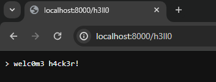
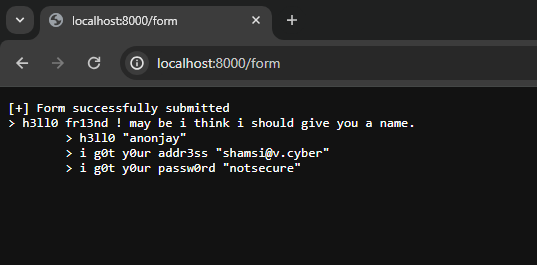
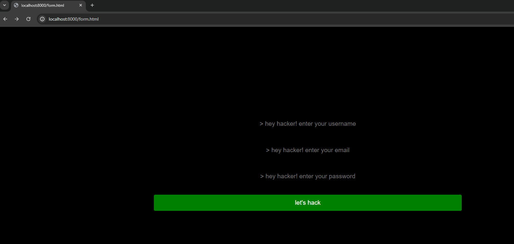

# go lang server
This is a go-lang based server through which basic endpoints and response handling is done.

## endpoints
* `/` - root page of the server where it is currently serving my personal portfolio when the server is run.
* `/h3ll0` - returns a greet text to the user.

* `/form` - this returns the data submitted to the `form.html`.
 
* `/form.html` - this form consists of details to be submitted to the go-lang server.

## port information
By default this go-lang server runs on port `8000`. However you can change that in the code.

## social links 
 
 
 